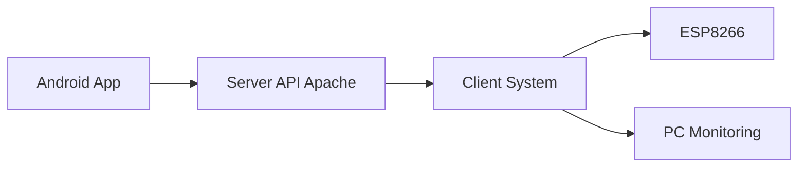
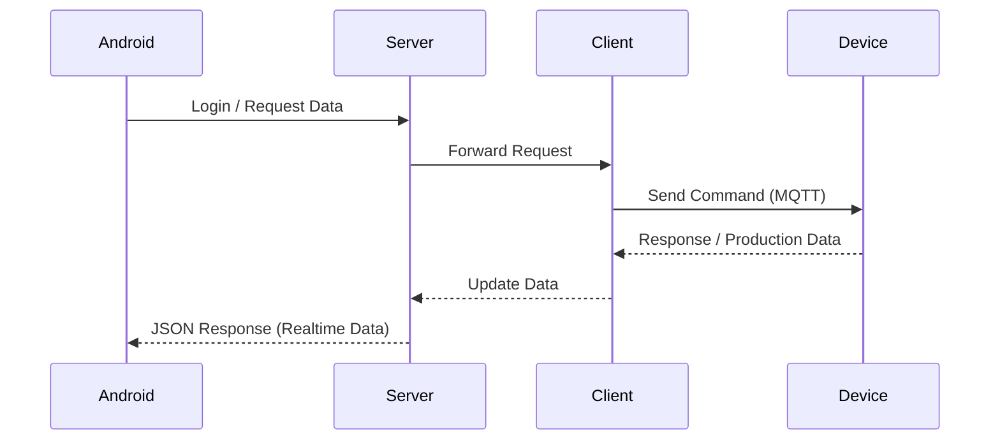

# 📊 Laporan Produksi (Android)

---

## 🚀 Overview

**Industrial SCADA-based production monitoring system that collects machine production data using ESP8266, sends it via MQTT, and displays it on a real-time production dashboard.**

This system is designed for:
- Industrial IoT (IIoT)
- Factory automation
- Production reporting systems

The Android application is built using **Flutter**, acting as a monitoring dashboard connected to a backend server and industrial devices.

---

## 🧩 System Architecture

---

## 🔄 Data Flow

---

## ⚙️ Technology Stack

- Mobile App: Flutter (Dart)  
- Backend: PHP (Apache Server)  
- Communication: MQTT  
- IoT Device: ESP8266 (Arduino)  
- Client System: PC / Industrial Controller  

---

## 📱 Key Features

- 🔐 User authentication  
- 📡 Real-time production monitoring  
- 📊 Production data visualization  
- ⚙️ Dynamic server configuration  
- 🔄 Auto reconnect & error handling  
- 🏭 Industrial SCADA integration  

---

## 🛠️ Download
- **Laporan Produksi (Windows) |** Latest Version  
   
➡️ [Download](https://github.com/viwaretech/laporan-produksi/releases/latest/download/laporan-produksi.zip)
---

## 📡 System Flow
    Android → Server → Client → ESP8266 / PC
---

## 👨‍💻 Author

Harley Afandi D  
Industrial Automation & IoT Solutions  

---

## 📄 License (Commercial Only)

Copyright (c) 2026 Harley Afandi D. All rights reserved.

This software is proprietary and confidential.

### 🚫 Restrictions
- Unauthorized copying, modification, distribution, or use is strictly prohibited  
- Reverse engineering, decompiling, or disassembling is not allowed  
- Redistribution in any form without written permission is prohibited  

### 💼 Commercial Usage
This software may only be used under a paid commercial license.

You are required to obtain a valid license if you:
- Use this software in industrial environments  
- Deploy in factory / production systems  
- Integrate into commercial or client projects  
- Modify or customize for business purposes  

### 📩 Licensing Contact
viwaretech@gmail.com  

### ⚖️ Legal
Any unauthorized use of this software may result in legal action.
